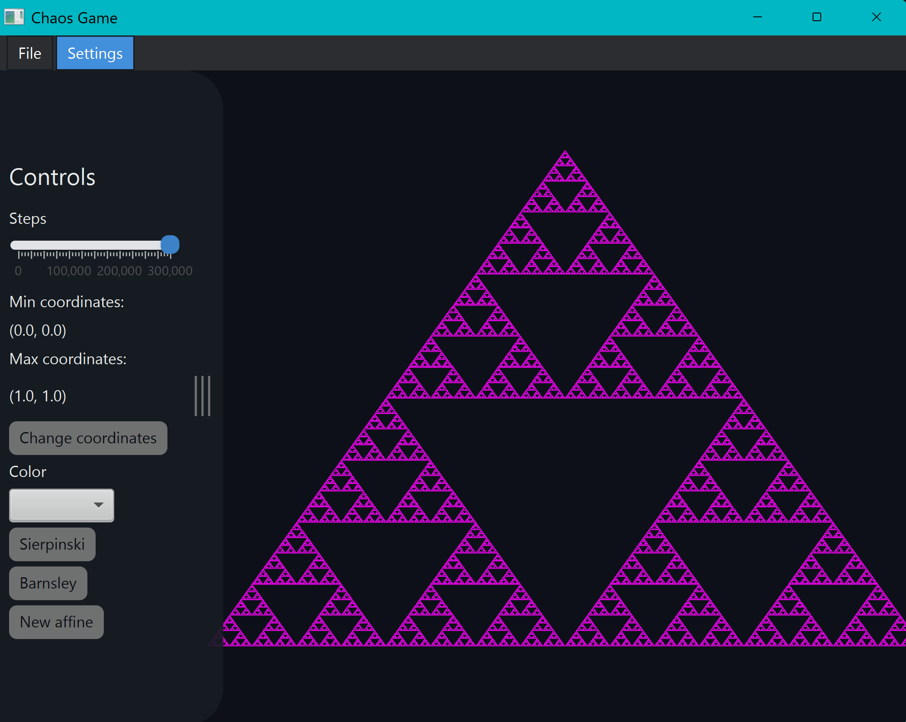
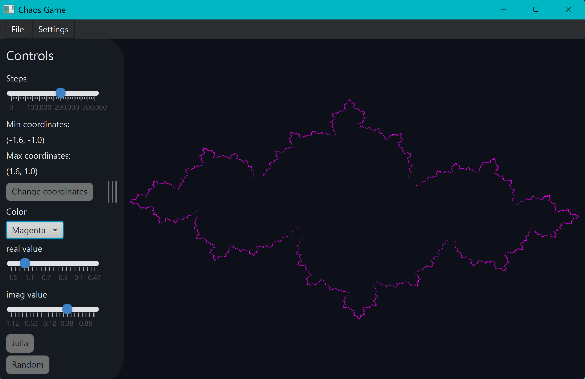

# Chaos Game

A JavaFX application for generating and visualizing fractals using affine and Julia transformations.

The application provides an interactive graphical interface for experimenting with different transformations and visualizing the resulting fractals.

> Originally developed as a group project for the IDATG2003 course at NTNU in 2024. The project is currently being maintained as a work in progress.

## Screenshots

### Sierpinski Triangle



### Julia Set



## Features

- Generate fractals using affine transformations
- Generate Julia sets
- Interactive JavaFX graphical interface
- Configure transformation parameters
- Load and save transformations
- Light and dark themes
- Collapsible control panel
- Automated tests with JUnit

## Technologies

- Java 21
- JavaFX 21
- Maven
- JUnit 5

## Project Structure

The application source code is located in `src/main`, with tests located in `src/test`.

The main application is divided into five packages:

- `chaosgame` — core Chaos Game logic and canvas representation
- `gui` — graphical user interface
  - `controllers` — GUI controllers and interaction logic
  - `models` — models used by the GUI
  - `observer` — observer-related functionality
  - `view` — application views and JavaFX components
- `math` — mathematical classes used by the transformations
- `transformations` — affine and Julia transformation implementations
- `utility` — file handling, configuration, logging, and other utilities

Application resources such as stylesheets, configuration files, and transformation files are located in `src/main/resources`.

## Requirements

To run the project, you need:

- Java Development Kit (JDK) 21

The project includes the Maven Wrapper, so a separate Maven installation is not required.

## Running the Application

Clone the repository and navigate to the project directory.

### Windows

```powershell
.\mvnw.cmd javafx:run